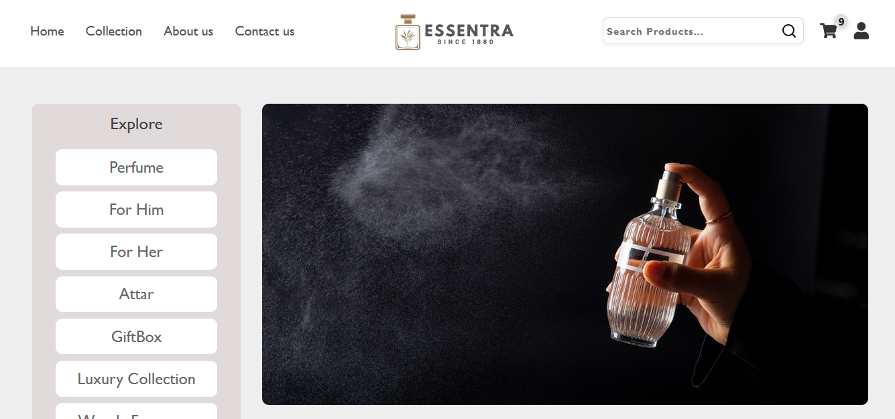
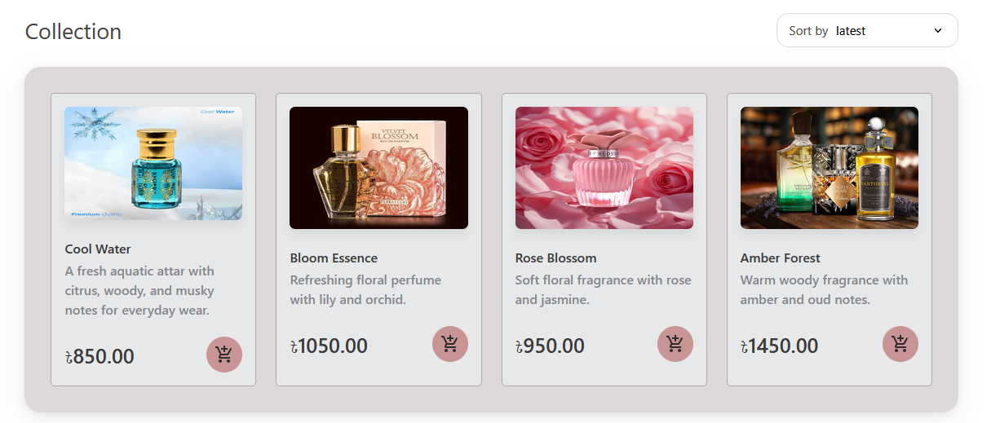
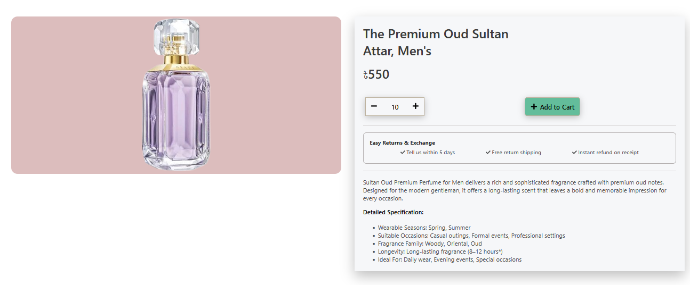
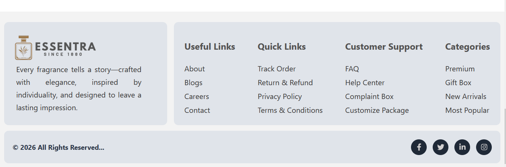

# 🌿 Essentra: Full-Stack Fragrance E-Commerce Platform

Essentra is a modern full-stack e-commerce platform built for premium fragrance shopping. The application aims to provide a seamless shopping experience with product browsing, authentication, cart management, secure checkout, and an administrative dashboard.

---

## 🚀 Tech Stack

### Frontend

- React
- Vite
- React Router
- CSS

### Backend

- Node.js
- Express.js
- Prisma ORM
- PostgreSQL

---

## ✨ Features

### Current

- Responsive user interface
- Product listing
- Product details page
- Search functionality (to be completed)
- Shopping cart interface
- navigation

## 🛣️ Future Roadmap

The following features are planned for future development:

- Connect the frontend and backend APIs
- Build a comprehensive admin dashboard
- Develop a user profile and account management system
- Integrate a payment system
- Add order history and order tracking
- Improve search and product filtering
- Optimize application performance and responsiveness

---

## 📂 Project Structure

```text
ecommerce/
├── README.md
├── screenshots/
├── frontend/
└── backend/
```

---

## 📸 Screenshots

### Home Page



### Product Listing



### Product Details



### Footer



> **Note:** Screenshots will be updated as the project progresses.

---
